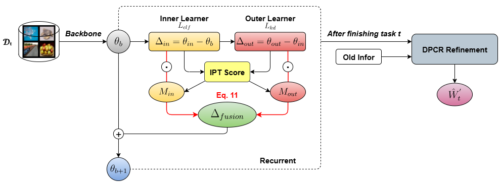

<div align="center">
  
# 【IOF-DP: Iterative Inner–Outer Fusion with Dual-Projection for Exemplar-Free Class-Incremental Learning
### Thanh-Nga Hoang Thi, Thanh-Thu Nguyen Mai,Quynh-Trang Pham Thi  * 
  
</div>

## Introduction
The official implementation for [IOF-DP: Iterative Inner–Outer Fusion with
Dual-Projection for Exemplar-Free
Class-Incremental Learning]

## Abstract
Exemplar-free class-incremental learning (EFCIL) trains models on a sequence of tasks without storing past samples, which is crucial under privacy or memory constraints. However, EFCIL remains challenging due to (i) catastrophic forgetting of old knowledge, (ii) semantic drift of features when the backbone adapts to new tasks, and (iii) decision bias favoring recently learned classes. We propose IOF-DP, an iterative inner–outer task-vector framework with importance-score-based fusion and a DPCR-based calibration stage. At each mini-batch, an inner step adapts to new classes while an outer step distills to the previous model, yielding two displacement vectors; importance scores provide parameter-wise soft masks to fuse them and balance plasticity vs. stability. After fusion, we adopt Dual-Projection to align old statistics and ridge-based reconstruction to rebalance the classifier. Experiments on standard EFCIL benchmarks show that IOF-DP achieves a superior stability–plasticity trade-off and improves overall accuracy over strong baselines. 
## Overview

<div align="center">

</div>

## Quick Start

### Setup code environment

See the details in [environment.yaml](environment.yaml)

A suitable [conda](https://conda.io/) environment named `dpcr` can be created and activated with:
```Bash
   conda env create -f environment.yaml
   conda activate dpcr
```

### Datasets

We provide the implementation on five benchmark datasets reported in the paper, i.e., CIFAR-100, and Tiny-ImageNet 200

### Run

You can run the experiments via the follow code.

```Bash
   python main.py --config ./exps/[your_configuration.json]
```
You can also change the settings in the .json file for different experiments. 

Part of arguments are listed followed.
- `dataset`: The dataset used in the experiment
- `init_cls`: The number of classses in the first task.
- `increment`: The number of classses of each task.
- `convnet_type`: Type of model used in the experiment, ResNet-18 by default. 
- `resume`: Choose whether to used the pre-trained weight.
- `model_dir`: Directory that store the model checkpoint or load the pre-trained weight (when resume=True). 
- `rg`: Regularization factor $\gamma$.
- `rg_tssp`: The regularization term in the TSSP, 1e-9 by default.


## Analytic Continual Learning

## Acknowledgment

The implementation of the codes is partly referred to [PyCIL](https://github.com/LAMDA-CL/PyCIL) and [ADC](https://github.com/dipamgoswami/ADC). We sincerely appreciate for their contributions.


